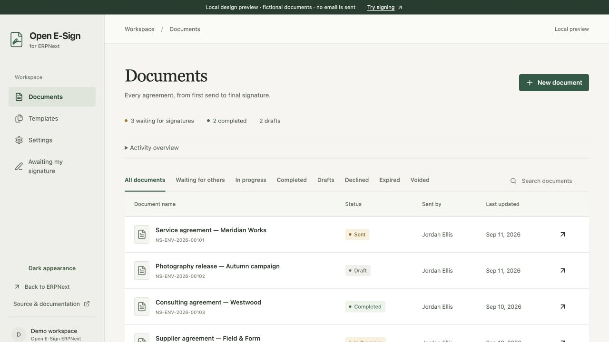
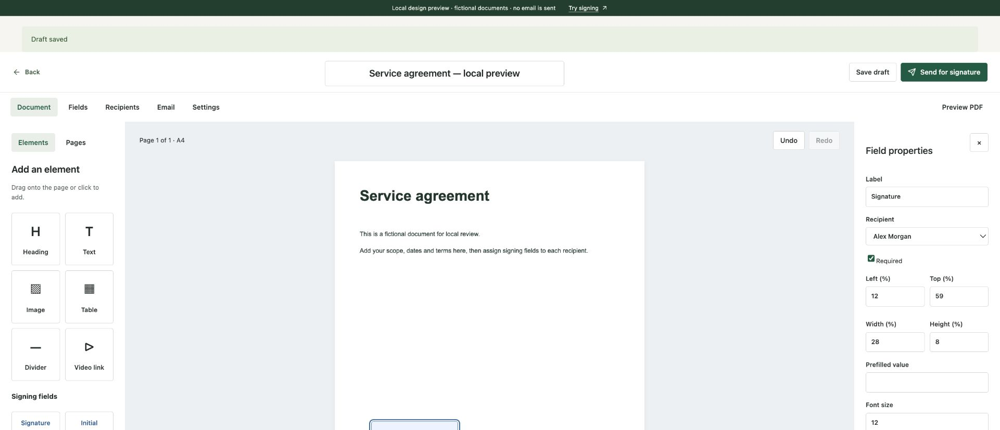
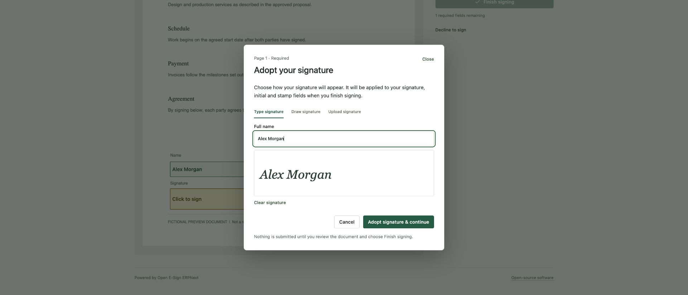
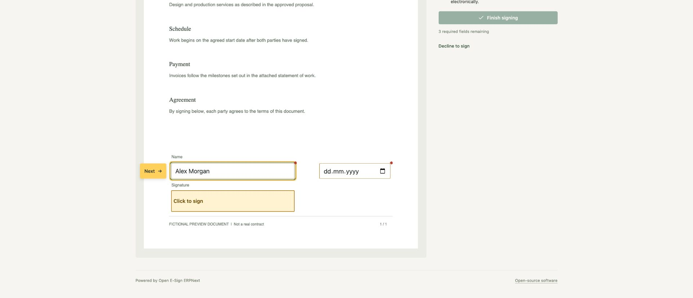
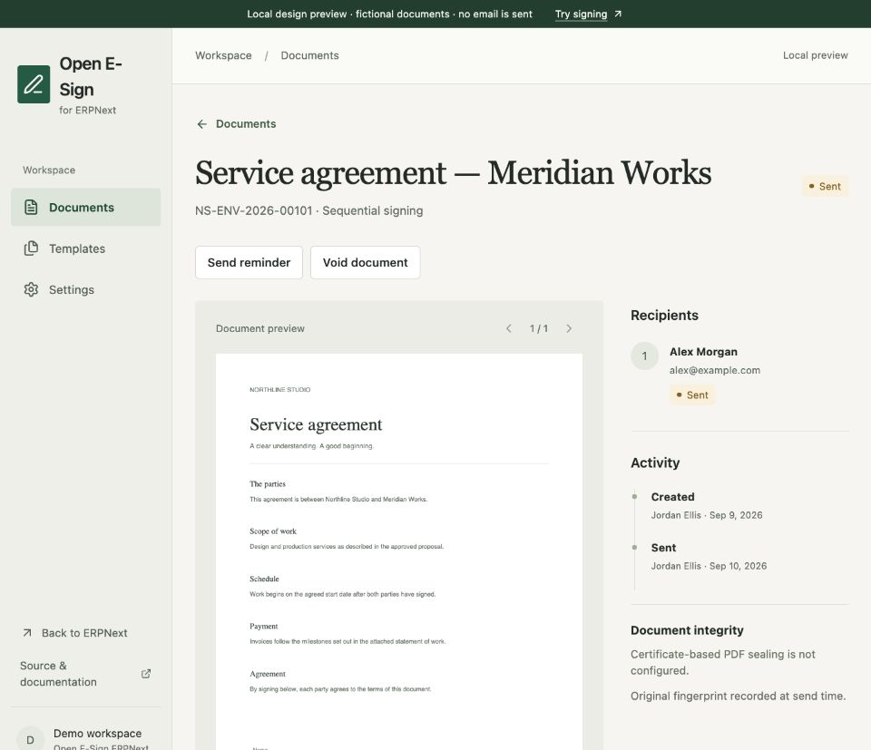

# Open E-Sign ERPNext

A document-first signing workspace for Frappe 16 and ERPNext. Prepare an existing PDF, choose recipients, place fields, and keep the completed files with your ERP records.

An independently maintained fork of [Nesscale Sign](https://github.com/bhavesh95863/nesscale_sign) by Nesscale Solutions. AGPL-3.0. The internal app name remains `nesscale_sign` for compatibility.

**Status: local-review release. Not deployed to production.** This is not a claim of DocuSign parity, legal certification, qualified signatures, or independently audited security. Read [security and deployment prerequisites](docs/SECURITY.md) before using real contracts.



## What it does

- A clear document register, searchable by title and signing status.
- Full-width document builder with draggable headings, text, images, tables, dividers and video-link text; page controls, content undo/redo, and contextual properties. Product lists and payments are excluded from this iteration.
- **New document** offers a choice between building from scratch and uploading an existing PDF. Both use the same canvas and signing-field palette. Uploaded PDF content stays fixed; signing fields remain editable.
- Drag signing fields directly onto any page. Page reordering keeps fields on their original content. Names, recipient mappings, required/read-only settings and coordinates are editable in the properties panel.
- Invitation Email Templates, per-document plain-text subject/body overrides, and up to five private attachments totaling 10 MB. A secure signing link is always included; the configured Frappe sending account remains in use.
- Sequential or parallel signing, email-link access, explicit electronic-signing consent, and typed, drawn, or uploaded signatures.
- Reusable PDF templates with edit, duplicate, archive and publish actions; existing Frappe document-event automation and recipient mappings.
- All original field types, repeat-across-pages controls, prefill and read-only values, explicit expiry, an awaiting-my-signature inbox and light/dark appearance.
- Permission-checked APIs; completed PDF and completion record attached to the selected ERP record.
- Original-PDF snapshots and SHA-256 fingerprints, protected audit records, serialized signing updates, and retryable PDF completion.
- Optional certificate-based PDF sealing with pyHanko. No signing certificate is included. Sealing is visibly reported as **not configured** until an operator configures one.
- Full frontend source, a reproducible build, and a loopback-only local preview with fictional data.



Builder content is stored with drafts and templates. Rendering produces a fixed PDF before sending; text overflow is rejected rather than silently clipped. Builder documents support 20 A4 pages and 200 blocks; PDF uploads retain the existing 100-page limit. Video blocks are link text, not embedded playback. Supporting email attachments are separate from the signed PDF and are copied when sending.



Names, emails, text, dates, checkboxes and dropdowns are edited directly on the PDF. A highlighted **Next** guide (or Enter) confirms the current field and advances across pages. Signature fields open a popup with type, draw and upload options, signature styles and black/blue/red ink. Final consent and **Finish signing** remain explicit.

During preparation, **Fill from a contact** searches Contacts permitted by the current Frappe user and copies the selected name and primary email into a recipient. Name and Email fields prefill from that recipient without overwriting existing field values. Each prefilled required field must still be reviewed. This is a snapshot, not a live contact link; phone, company and address mapping are not included. Guest signing links cannot query Contacts.

**Date** is an editable calendar field. **Date Signed** remains generated by the server when signing completes.



[Example completion certificate](docs/examples/completion-certificate.pdf) · [Deployment handoff and sealing setup](docs/DEPLOYMENT.md)



## Try the design locally

Node 22.12+ (Node 24 recommended):

```sh
git clone --branch codex/open-esign https://github.com/joscasjac/nesscale_sign.git
cd nesscale_sign/frontend
npm ci
npm run preview:local
```

Open **http://127.0.0.1:4173/nesscale-sign**. Use **Try signing** in the preview banner to sign a fictional document and download a generated sample PDF.

This preview uses a separate in-memory server at `127.0.0.1:4174`. It does not connect to ERPNext, send emails, provide cryptographic seals, or persist data after restart. It demonstrates the actual frontend with a simulated API; it is not a substitute for the Frappe backend tests. Desk-only settings require a real Frappe site. The preview service is excluded from the production build.

## Install on a test Frappe site

Requires **Frappe 16, Python 3.14+, Node 24**, MariaDB, Redis and working Frappe workers/scheduler. ERPNext is optional for standalone signing; record links require the referenced DocType to be installed.

```sh
cd /path/to/frappe-bench
bench get-app --branch codex/open-esign https://github.com/joscasjac/nesscale_sign.git
bench --site YOUR_TEST_SITE install-app nesscale_sign
bench --site YOUR_TEST_SITE migrate
bench build --app nesscale_sign
```

Open `/nesscale-sign`. Assign `Nesscale Sign User` or `Nesscale Sign Manager` roles in Frappe. Configure an outgoing **Email Account** for invitations. The app does not supply an email service.

The built frontend is committed for installation on Frappe Cloud; frontend source lives in `frontend/`. Installing requires a bench deployment and a site install. **Do not deploy this local-review branch to a live site without testing and explicit approval.**

## Build and test

```sh
cd frontend
npm ci
npm run build
npm test
```

The build writes `nesscale_sign/public/frontend/` and the Frappe HTML entrypoint. Never hand-edit compiled assets.

On an isolated Frappe site (tests create records):

```sh
bench --site YOUR_TEST_SITE set-config allow_tests true
bench --site YOUR_TEST_SITE run-tests --app nesscale_sign
```

See [API examples](docs/API.md), [security configuration](docs/SECURITY.md), [local validation notes](docs/VALIDATION.md), and [changes](CHANGELOG.md).

## Existing documents and Drive

Document authoring remains in your existing tools. Upload the finished PDF or use a saved template. Optionally enter the source DocType and record name when preparing a document. The sender must have write access to that record. Final PDFs and completion records are attached there.

There is no direct Frappe Drive picker yet. Export/upload a PDF from Drive; the signing app freezes its own copy when sending, so later edits to the working document cannot change the agreement being signed.

## Contributing and license

See [CONTRIBUTING.md](CONTRIBUTING.md). Keep improvements reusable, document migrations, and test permission boundaries. No production keys, personal documents, or real signer data belong in fixtures or screenshots.

Licensed under [AGPL-3.0](license.txt). Preserve upstream attribution and offer corresponding source to network users of modified versions as required by the license. This fork keeps a visible source link in the app. Branding does not imply endorsement by Nesscale Solutions or Frappe.

See the [upstream feature comparison](docs/FEATURES.md) for where each original capability lives.
