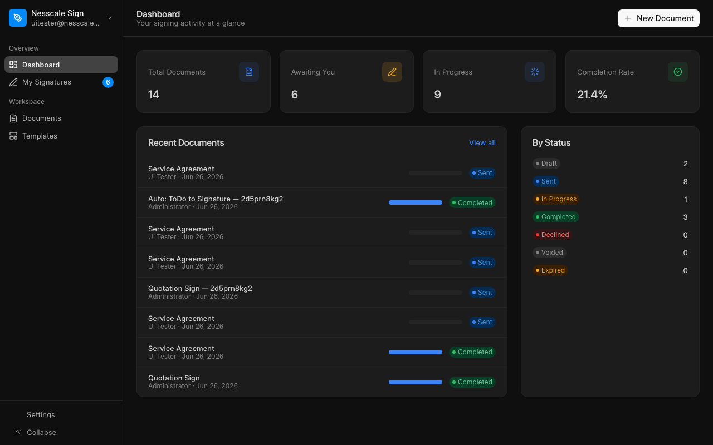
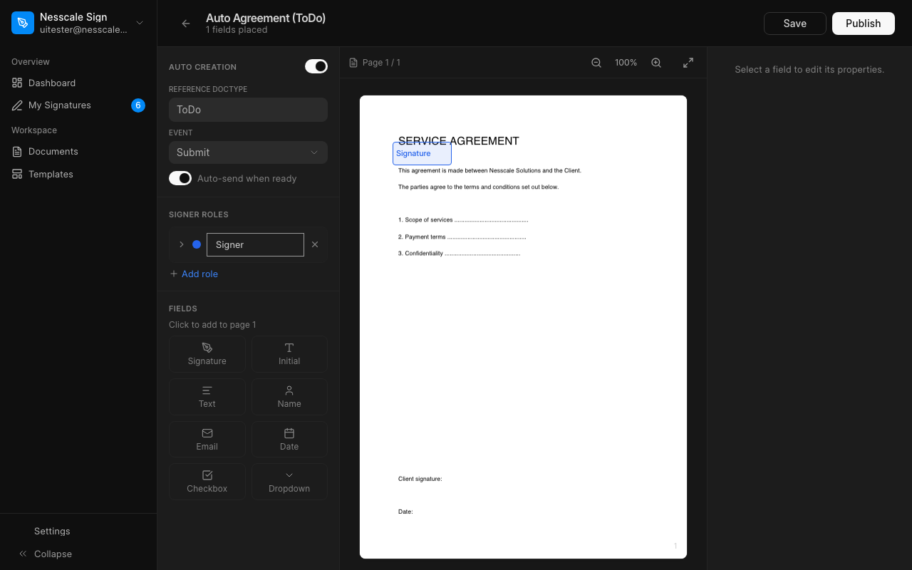
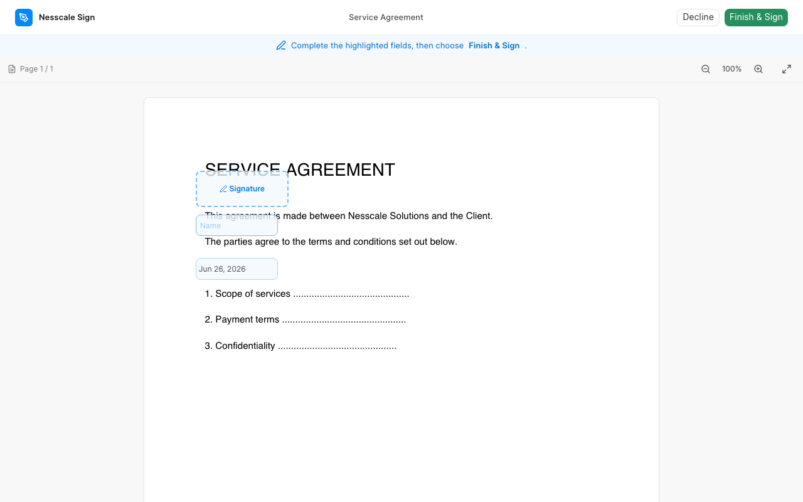

# Nesscale Sign

An e-signature app for Frappe. Upload a PDF, place the fields, and send it out for signature.

## Features

- Upload PDF documents and reuse them as templates
- Drag and drop fields onto the document (signature, initials, name, email, date, text, checkbox, dropdown)
- Repeat a field across multiple pages
- Multiple signers with sequential or parallel signing order
- Sign without logging in, using a secure link
- Draw, type, or upload a signature
- Signed PDF with a certificate and audit trail
- Email invitations, reminders, and expiry
- Create documents automatically from a Frappe DocType event (optional)
- Editable email templates
- Dark mode UI

## Screenshots







## Documentation

Full documentation, with screenshots: https://sign.bhavesh.tech/nesscale-sign-home

## Install

```bash
cd your-bench
bench get-app https://github.com/your-org/nesscale_sign --branch version-16
bench install-app nesscale_sign
```

The app opens at `/nesscale-sign`. Signing links open at `/sign/<token>`.

## Tests

```bash
bench --site <site> run-tests --app nesscale_sign
```

## Support

If this app is useful to you, you can support its development:

[Donate via PayPal](https://paypal.me/nesscale)

## License

AGPL-3.0. See [license.txt](license.txt).

Copyright (c) Nesscale Solutions Pvt Ltd — info@nesscale.com
